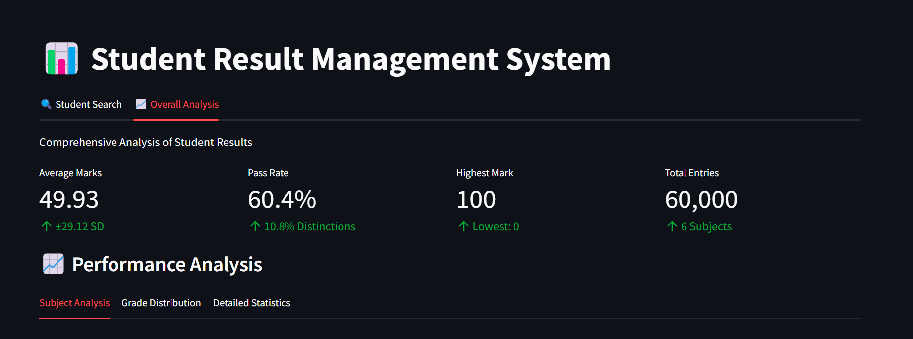
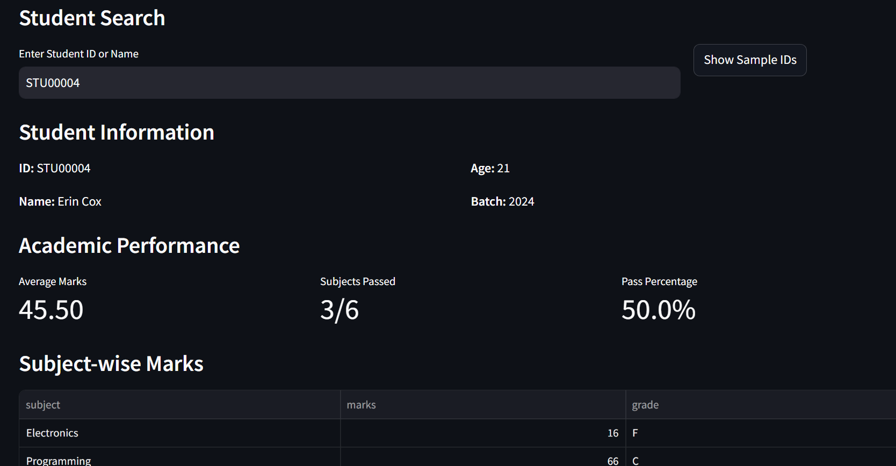
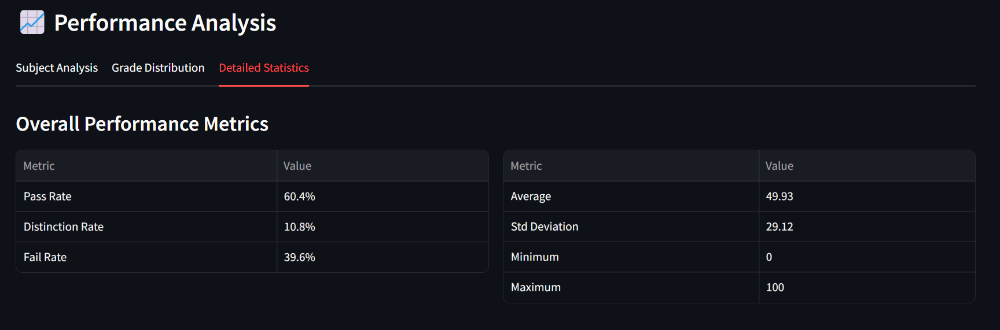
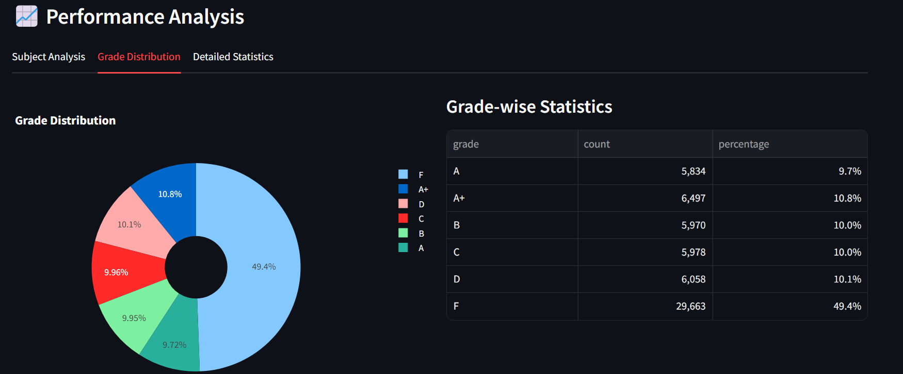

# 📊 Student Result Management System

A comprehensive system for managing and analyzing student results using Python, PySpark, and Streamlit. This project handles data for 10,000 students across 6 subjects, providing detailed analytics and an interactive dashboard.



## 🌟 Features

### 1. Data Generation & Management
- Generates realistic data for 10,000 students
- Creates profiles with student ID, name, age, and batch information
- Generates marks for 6 core subjects with automatic grade assignment:
  - Electronics
  - Programming
  - Database
  - Data Science
  - Mathematics
  - DSA

### 2. Data Analysis (Using PySpark)
- **Statistical Analysis:**
  - Overall performance metrics
  - Subject-wise analysis
  - Grade distribution
  - Pass/Fail statistics

- **Performance Metrics:**
  - Average marks with standard deviation
  - Minimum and maximum marks
  - Pass percentages by subject
  - Subject-wise performance trends

### 3. Interactive Dashboard

#### Student Profile View
- Comprehensive student information display
- Individual performance metrics
- Subject-wise marks breakdown
- Grade visualization
- Search by Student ID or Name



#### Performance Analytics Dashboard
- **Overall Performance Dashboard**
  - Key performance indicators
  - Statistical analysis
  - Performance trends
  - Subject-wise comparisons
  - Overall average marks
  - Pass rate with distinction percentage
  - Highest/lowest marks
  - Total entries and statistics



#### Grade Distribution Analysis
- Visual representation of grades
- Subject-wise grade breakdown
- Performance metrics
- Statistical distribution
- Interactive subject-wise performance charts
- Grade distribution pie charts
- Detailed statistical tables
- Pass/Fail analysis by subject



## 🛠️ Technology Stack
- Python 3.x
- PySpark 3.5.4
- Streamlit 1.42.2
- Pandas 2.2.3
- Plotly 6.0.0
- Additional libraries:
  - Faker (for data generation)
  - Matplotlib (for visualization)
  - Seaborn (for statistical plots)

## 📁 Project Structure
```
student-result-management/
├── data/                      # Data storage
│   ├── students.csv          # Student profiles
│   └── marks.csv            # Student marks
├── analysis_results/         # Analysis output
│   ├── overall_stats.csv
│   ├── subject_stats.csv
│   ├── grade_dist.csv
│   ├── performance_metrics.csv
│   └── subject_performance.csv
├── screenshots/              # Documentation images
├── src/
│   ├── data_generator.py    # Data generation script
│   ├── spark_analysis.py    # PySpark analysis
│   └── dashboard.py         # Streamlit dashboard
├── requirements.txt         # Dependencies
└── README.md               # Documentation
```

## 📊 System Features

### Home Page
- Overview of the system
- Quick navigation options
- System statistics
- Performance highlights
- Real-time data updates

### Student Management
- Student profile creation and management
- Batch-wise organization
- Unique student ID generation
- Personal information tracking

### Academic Records
- Subject-wise mark entry
- Automated grade calculation
- Performance tracking
- Historical data maintenance

### Analysis Capabilities
- Real-time statistical analysis
- Performance trend visualization
- Grade distribution analysis
- Subject-wise comparisons
- Batch performance metrics

### Reporting Features
- Detailed student reports
- Performance summaries
- Grade distribution reports
- Statistical analysis reports
- Export capabilities

## 🔧 Customization Options
The system supports customization of:
1. Number of students (configurable in data generation)
2. Subject list and weightage
3. Grade boundaries and criteria
4. Performance metrics and KPIs
5. Report formats and layouts

## 🤝 Contributing
Contributions are welcome! Please feel free to submit a Pull Request.

## 📝 License
This project is licensed under the MIT License - see the [LICENSE](LICENSE) file for details.

## 👥 Authors
- Rahul❤️

## 🙏 Acknowledgments
- Built as part of the Data Engineering course project
- Thanks to all contributors and testers
- Special thanks to [Your Institution/Organization]

## 📞 Support
For support, please create an issue in the repository or contact [your-email@example.com] 